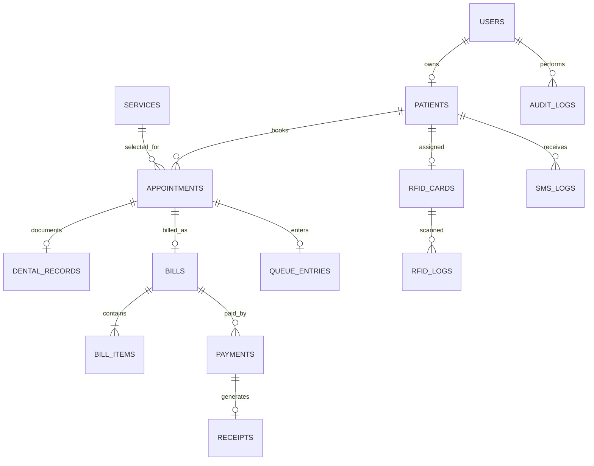

# DentalCare Clinic

A Laravel 13 clinic portal for patient registration, appointment requests, walk-ins, RFID-assisted check-in, dental records, billing, payments, receipts, and clinic activity logs.

## Setup

Requirements: PHP 8.3+ with `fileinfo` and `pdo_sqlite` enabled (when using SQLite), Composer, and Node.js/npm.

```powershell
# Only needed if Node.js is installed but npm is not on PATH:
$env:PATH = "$env:ProgramFiles\nodejs;$env:PATH"
composer run setup
php artisan clinic:create-admin "Clinic Doctor" doctor@example.com
npm run dev
```

The administrator creation command prompts for a password without echoing it and refuses to create a second administrator. `composer run setup` installs dependencies, creates the default SQLite database file if needed, generates the application key, runs migrations and seeds the example dental services, then installs/builds front-end dependencies.

In a second terminal, run the web server:

```powershell
php artisan serve
```

Patient accounts can be registered from the sign-in page. The first administrator must be created with the Artisan command; staff accounts are created by an administrator from **Staff accounts**.

For appointment reminders in a local environment, run `php artisan schedule:work` in another terminal. Production should run Laravel's scheduler every minute using the deployment platform's scheduled-task mechanism.

## Architecture

### Application modules

| Module | Main routes | Responsibility |
| --- | --- | --- |
| Authentication | `/login`, `/register`, `/logout` | Session login, public patient registration, throttling, and active-account enforcement |
| Portals | `/dashboard` | Role-specific patient, staff, and administrator summaries |
| Patients | `/clinic/patients` | Patient directory, registration, profile management, and history |
| Appointments | `/appointments` | Online requests, walk-ins, approval, rescheduling, cancellation, and status transitions |
| RFID and queue | `/clinic/rfid`, `/clinic/queue` | UID assignment, scan logging, patient identification, check-in, and queue progression |
| Dental records | `/clinic/appointments/{appointment}/record`, `/my/dental-records` | Administrator-entered clinical notes and patient-owned history |
| Services | `/clinic/services` | Service catalog; only administrators can create, edit, activate, or price services |
| Billing and receipts | `/clinic/billing`, `/receipts/{receipt}` | Bill snapshots, partial payments, immutable payment/receipt records, and print layout |
| Administration | `/admin/staff`, `/admin/reports`, `/admin/audit-logs`, `/admin/sms-logs` | Staff access, reporting, and operational logs |

Controllers coordinate HTTP validation and responses. Eloquent models define the relational data, `AuditTrail` records clinic actions, and `SmsNotifier` isolates outbound messaging. Role middleware enforces access on the server as well as in navigation. Patient endpoints scope appointments, records, bills, messages, and receipts to the authenticated patient's own profile.

### Data relationships



The database enforces unique email addresses, patient numbers, service names, RFID UIDs, bill numbers, transaction IDs, receipt numbers, one bill per appointment, and one queue entry per appointment. Billing items keep a snapshot of service name and price so later catalog edits do not rewrite historical bills.

### Appointment and payment flow

1. A patient requests an online appointment; its initial status is `pending`. Staff or the administrator approves or rejects it.
2. New appointment bookings are available Monday through Saturday, 10:00 AM–5:00 PM, in 10-minute increments; the clinic is closed Sundays. Staff create walk-ins for existing or newly registered patients; walk-ins are immediately placed in the day's queue. An approved appointment can also be checked in with the patient's RFID UID.
3. Staff use **Patient queue** to call a waiting patient, start the visit, or mark a checked-in patient as a no-show. During consultation, an administrator enters the dental record.
4. Once a dental record exists, staff or the administrator can create the bill during consultation. The appointment becomes `billed`; its item snapshots the service price, and billing supports discounts and partial payments.
5. Every successful payment creates a transaction and receipt in the same database transaction. The appointment remains `billed` after payment; staff or an administrator can mark it `completed` only when the bill is itemized and fully paid. A zero-balance bill is finalized as paid when created. Overpayment change is recorded for cash. Payment and receipt records have no delete endpoint.

## External integrations

- **RFID:** the check-in page accepts a scanned UID as text, which works with keyboard-wedge scanners. Direct serial, USB, or network hardware integration is not included. RFID is not used for account authentication.
- **SMS:** set `CLINIC_SMS_ENDPOINT` and `CLINIC_SMS_TOKEN` in the environment. The endpoint is expected to accept a bearer-authenticated JSON `POST` with `to` and `message` fields. Each attempt is logged; an unconfigured or unavailable gateway is recorded as failed rather than reported as sent. Provider-specific payloads may require adapting `SmsNotifier`.
- **Payments:** cash, GCash, card, and other transactions are recorded manually. The application does not charge cards or contact a payment processor.
- **PDF:** use **Print / save PDF** on a receipt or report and select “Save as PDF” in the browser print dialog.

Clinic name, address, contact number, and currency symbol can be set with `CLINIC_NAME`, `CLINIC_ADDRESS`, `CLINIC_PHONE`, and `CLINIC_CURRENCY_SYMBOL`. SMS settings and clinic details belong in the environment, never in source control.
